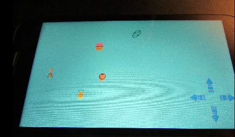
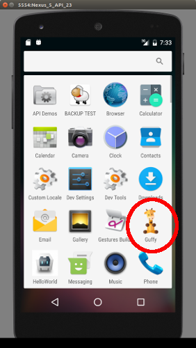

RAPT Pygame Codecakes Example
=============================

## Who RAPT Pygame Development is For

I am a parent teaching my middle school child to program in Python. My recommendation is to
 only use RAPT Pygame if you feel comfortable with the characteristics below.

- You like Python or at least are attracted to the structure
- You don't want to dive into JavaScript games right now due to the funkiness with JavaScript syntax
- You're using the application for personal use or just for learning purposes

RAPT Pygame takes
a Pygame program and allows it to run on Android phones. If you're writing a commercial game
or an application for work, you should use something with more support. For example, you should use
[Kivy](https://kivy.org/). The main problem with Kivy for teaching is that it's harder to learn for children.

Another mobile game framework is [Phaser](http://phaser.io/). This is JavaScript framework that is 
fairly easy to use, but not as easy as Pygame.

This example was modified from [rapt-pygame-example](https://github.com/renpytom/rapt-pygame-example) by 
[renpytom](https://github.com/renpytom).

The game code was written by a 12 year old girl that is just starting to learn Python.

## Screenshot on Moto G 3rd Gen

- 720 x 1280 screen resolution
- Android 6.0

## Notes

- does not save state. Deleted code to keep things simple
- build was done on Ubuntu 17.04

## Tips For Developing with RAPT Pygame

### Customize Android Icon and Presplash Screen

You can create a custom icon and splash screen.

- icon for the Android phone is called android-icon.png
- splashscreen is android-presplash.jpg

### Build Without Install

Assuming you're in the sub-directory `rapt`, you can build a release. You do not need to install it.

    rapt$ python android.py build ../rapt-test/ release

The `.apk` file will be in `/bin/`. 

You'll see file that looks like this: `Guffy-1.0-release.apk`

You can then install it on an Android emulator or a real phone.

    $ ./adb install ~/Development/rapt-python/rapt/bin/Guffy-1.0-release.apk 
    /home/craig/Development/rapt-python/ra.... 13.1 MB/s (23181220 bytes in 1.683s)
        pkg: /data/local/tmp/Guffy-1.0-release.apk

### Screenshot of Install on Emulator

- using Intel HAXM (x86)

### Debug

With the Android emulator or physical phone connected with USB

    $ ./adb logcat |grep pygame
    09-26 19:32:19.628  2120  2136 I python  : main.py:4: UserWarning: Pygame has already been imported, import_as_pygame may not work.
    09-26 19:32:19.628  2120  2136 I python  :   pygame_sdl2.import_as_pygame()

Step 0: Ready the game.
-----------------------

Please ensure that the main file of your game is named main.py.

Please ensure that your game will run with pygame_sdl2. Generally, this
consists of adding the lines::

    try:
        import pygame_sdl2
        pygame_sdl2.import_as_pygame()
    except ImportError:
        pass

to the top of your main.py file, before the first import of pygame. (However,
note that pygame_sdl2 does not yet implement all of pygame.)

For now, RAPT supports only python2.7.

This repository serves as a simple pygame_sdl2-ready game.

Step 1: Install dependencies.
-----------------------------

RAPT depends on your computer having a JDK in the path, and Python 2.7 installed.
On Windows, you'll need a 32-bit JDK if you're using a 32-bit Python 2.7.

You may also need to install device drivers and permissions to ensure that
the Android SDK will talk to your device.

Step 2: Download and unzip RAPT.
--------------------------------

Download the latest nightly build of RAPT from
http://nightly.renpy.org/current/ . The file you want will end in -rapt.zip.
Unzip the file. All further commands should be run from inside the rapt
directory.

Step 3: Install the Android SDK.
--------------------------------

This can be done by running::

    python android.py installsdk

RAPT will prompt you to accept various license, and create a signing key.
This has to be done only once per RAPT install.

Step 4: Configure the game.
---------------------------

Configure the game::

    python android.py configure /path/to/rapt-pygame-example

The correct answers vary depending on the game. For our example, we used:

* Full Name: Android Test
* Short Name: Android Test
* Package Name: org.renpy.android_test
* Human-readable Version: 1.0
* Version Code: 100
* Orientation: 1) Landscape
* Expansion APK: 1) No
* Android Version: 3) Android 4.0
* Application Layout: 1) Single directory, device internal storage.
* Include Source Code: no
* Permissions: VIBRATE
* SQlite3: no (may not work)
* PIL: no (may not work)

This must be done once per game.

Step 5: Build, Install, and Run the game.
-----------------------------------------

This can be done with the command::

    python android.py --launch build /path/to/rapt-pygame-example release install

This must be done each time the game changes, to ensure the latest version is
on the device.

---

## Modules Implemented

* pygame_sdl2.color
* pygame_sdl2.display
* pygame_sdl2.draw
* pygame_sdl2.event
* pygame_sdl2.font
* pygame_sdl2.gfxdraw
* pygame_sdl2.image
* pygame_sdl2.joystick
* pygame_sdl2.key
* pygame_sdl2.locals
* pygame_sdl2.mixer (including mixer.music)
* pygame_sdl2.mouse
* pygame_sdl2.scrap
* pygame_sdl2.sprite
* pygame_sdl2.surface
* pygame_sdl2.sysfont
* pygame_sdl2.time
* pygame_sdl2.transform
* pygame_sdl2.version

Experimental new modules include:

* pygame_sdl2.render
* pygame_sdl2.controller

Documentation
-------------

pygame-sdl documentation can be found at:

    http://pygame-sdl2.readthedocs.org/

